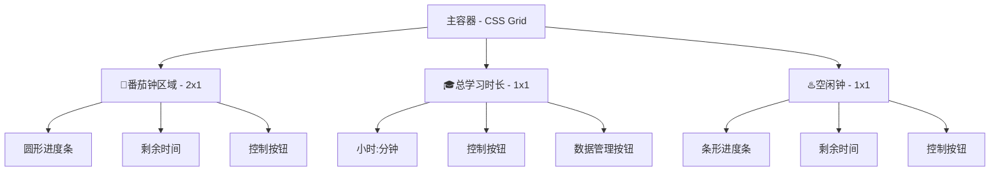
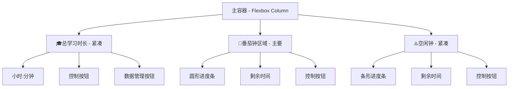

# 单 HTML 番茄钟应用设计文档

## 1. 概述

本文档旨在设计一个简洁、高效的单 HTML 番茄钟应用，帮助用户记录学习时长并有效管理时间。应用将包含总学习时长统计、可自定义的番茄钟和独立的空闲钟三大核心功能。

## 2. 功能需求

### 2.1 核心功能

- **已学习时长**
  - 精确到秒，持续累加用户的有效学习时间。
  - 以“小时:分钟”（H:MM）的格式清晰展示。
  - 数据通过浏览器 `localStorage` 持久化，关闭页面不丢失。
  - 提供“🧹（清空）、☑️（确认）和 ❎（取消）”按钮和相关功能.
  - 提供“📄（导出数据文件）、⚙️（应用数据文件）和 🏠（[源码](https://github.com/PJ-568/time-of-studying)）”数据管理按钮和相关功能。
- **番茄钟**
  - 用户可自定义倒计时长（分钟:秒）（默认为 25 分钟）。
  - 提供“▶️（开始）”、“⏸️（暂停）”、“⏹️（停止）”控制功能。
  - 倒计时结束或取消时，将已进行的时间计入“已学习时长”。
  - 界面需包含一个直观的圆形进度条，实时反馈剩余时间。
  - 倒计时结束时，通过浏览器通知或声音进行提醒。
- **空闲钟**
  - 一个独立的、简单的倒计时工具。
  - 用户可自定义倒计时长（分钟:秒）（默认为 5 分钟）。
  - 提供“▶️（开始）”、“⏸️（暂停）”、“⏹️（停止）”功能。
  - 界面需包含一个直观的条形进度条，实时反馈剩余时间。
  - 此倒计时不计入总学习时长。

### 2.2 高级功能

- **时间输入验证与格式化**
  - 时间输入框具有智能格式化功能，自动处理用户输入
  - 支持自动添加冒号分隔符
  - 限制输入长度和格式，确保时间值的有效性
  - 在输入框失去焦点时验证时间值的有效性
- **页面可见性处理**
  - 当页面不可见时暂停计时器计算
  - 当页面重新可见时，根据经过的时间更新计时器状态
  - 确保计时器在页面切换时的准确性
- **页面关闭提醒**
  - 当用户尝试关闭有运行中计时器的页面时，显示提醒确认
  - 防止用户意外关闭页面导致计时数据丢失

### 2.3 技术选型

- **前端框架**：无。使用原生 HTML、CSS 和 JavaScript，确保应用轻量、快速。遵循最小、最简代码原则。
- **数据存储**：`localStorage`，用于持久化存储总学习时长和各计时器的预设时间。
- **样式**：原生 CSS，实现简洁、现代化的界面风格，支持深色和浅色主题。

## 3. 界面与交互设计 (UI/UX)

采用无文字描述的界面以提升不同语种用户体验。（标题为“🎓🍅♨️”）

应用将采用响应式网格布局，根据不同屏幕尺寸自动调整排列方式，确保所有功能在任何设备上都能一次性展示，无需滚动。

当按下 🗑（清空）后，其消失，显示 ☑️（确认）和 ❎（取消）按钮。
如果用户点击“取消”，则回到上一状态。
当用户点击“确认”，则清空学习时长并返回初始状态。

当番茄钟或空闲钟未处于运行状态时，“剩余时间”可编辑，操作按钮处显示“▶️（开始）”按钮。
当番茄钟或空闲钟处于运行状态时，“剩余时间”不可编辑，操作按钮处显示“⏸️（暂停）”和“⏹️（停止）”按钮。

### 3.1 响应式布局策略

#### 大屏幕设备（> 1200px）

采用 2x2 网格布局，番茄钟占据左侧两个单元格，突出主要功能：



#### 中等屏幕设备（768px - 1200px）

采用水平三列布局，番茄钟占据 50% 宽度：


#### 小屏幕设备（< 768px）

采用紧凑型垂直布局，确保总高度不超过屏幕可视区域：



### 3.2 响应式断点设计

- **小屏幕**：< 768px，垂直紧凑布局
- **中等屏幕**：768px - 1200px，水平三列布局
- **大屏幕**：> 1200px，2x2 网格布局

### 3.3 布局切换动画

屏幕尺寸变化时，应用平滑的过渡动画，保持用户操作状态的连续性，确保用户体验的一致性。

## 4. 数据结构

应用所需的数据结构非常简单，将使用一个 JSON 对象存储在 `localStorage` 中。

```json
{
  "totalStudyTime": 0,
  "pomodoroTime": 1500,
  "idleTime": 300
}
```

- `totalStudyTime`: 以秒为单位存储的总学习时长。
- `pomodoroTime`: 以秒为单位存储的番茄钟时长。
- `idleTime`: 以秒为单位存储的空闲钟时长。
